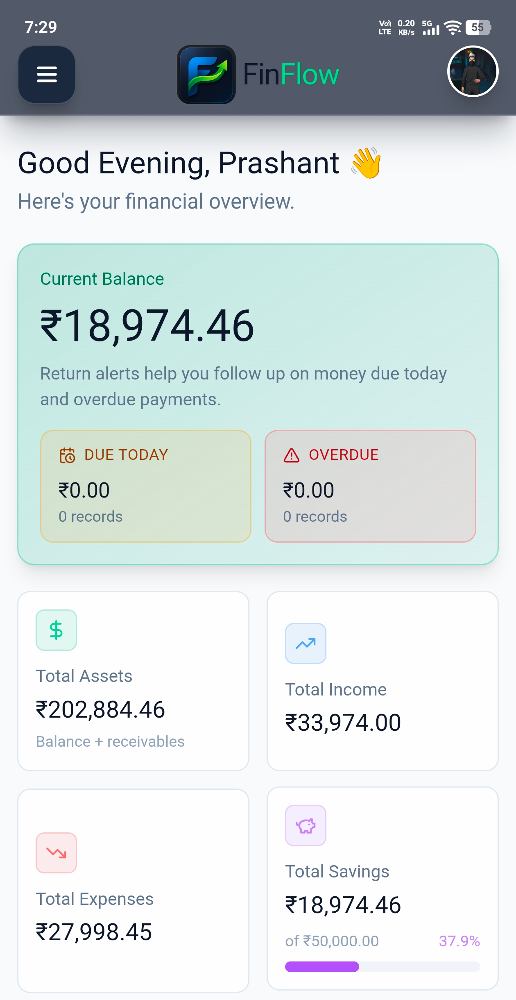
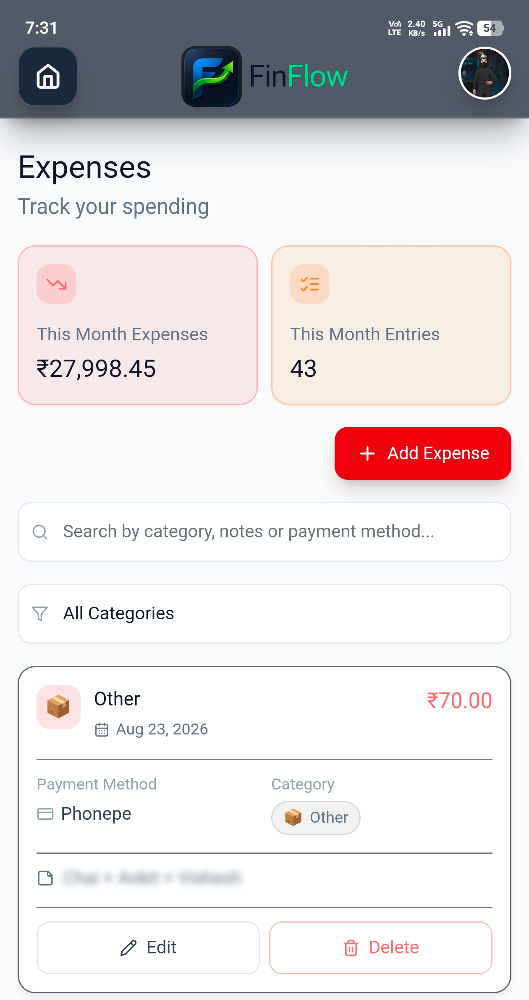
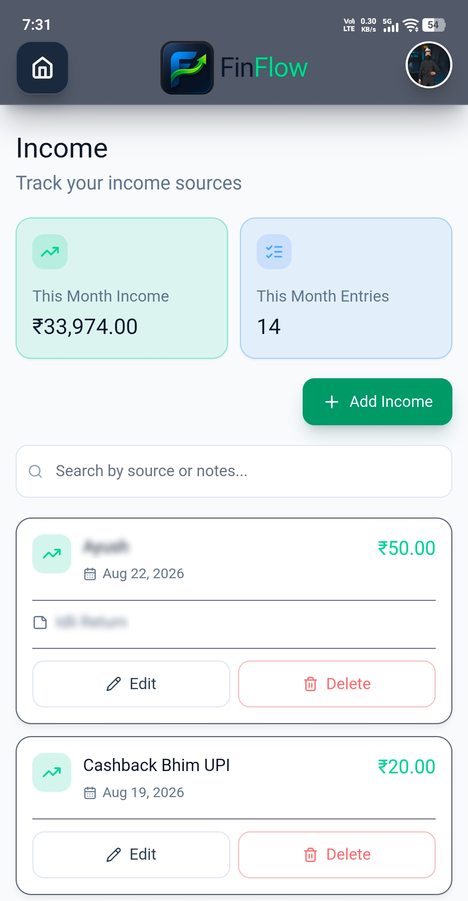
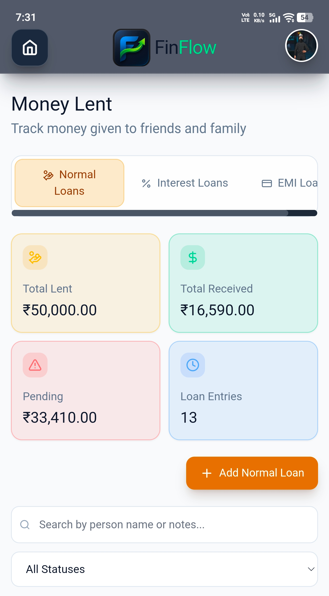
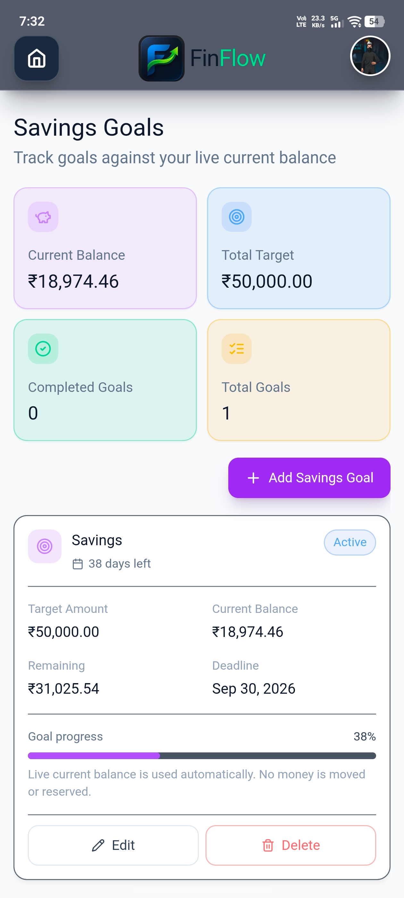

# FinFlow

> A modern personal finance manager for tracking income, expenses, money lent, loans, savings goals, reports, and financial history.

## 📱 About FinFlow

FinFlow is a personal finance management application designed to keep everyday financial information organized in one place.

It provides tools for managing income, expenses, money lent, interest loans, EMI loans, savings goals, reports, backups, reminders, and account settings.

## ✨ Features

- 🏠 Dashboard with financial overview
- 💰 Income tracking
- 💸 Expense tracking
- 🤝 Money Lent management
- 📈 Interest loan management
- 🧾 EMI loan management
- 🎯 Savings goals
- 📊 Financial reports
- 🔄 Backup and restore
- 🔔 Financial reminders and notifications
- 🔐 Google Sign-In
- ☁️ Supabase backend
- 🎨 Theme and currency settings

## 📸 Screenshots

### Dashboard

### Expenses

### Income

### Money Lent

### Savings Goals

## 📥 Download

The latest Android release is available from the GitHub Releases section.

Download the latest APK from:

**Releases → Latest release → Assets**

## 📲 Installation

1. Download the latest `FinFlow-*.apk` from the Releases section.
2. Open the downloaded APK on your Android device.
3. Allow installation from the requested source if Android asks for permission.
4. Install FinFlow.
5. Open the application and sign in.

## 🔄 Updates

New versions of FinFlow will be published through GitHub Releases.

When a new version is available:

1. Open the latest GitHub Release.
2. Download the new APK.
3. Install it over the existing FinFlow installation.

Your existing app data should remain available when updating the application normally.

## 📱 Android Requirements

- Android 7.0 (API 24) or newer
- Package: `com.prashant.FinFlow`

## 🔐 Security

FinFlow releases are signed with the official FinFlow release signing key.

Do not download FinFlow APK files from unofficial sources.

## 📄 License

FinFlow is proprietary software.

The source code is maintained in a private repository. See the license information distributed with the application for usage restrictions.

## ⚠️ Disclaimer

FinFlow is a personal finance management tool.

Users are responsible for the financial information they enter and for any financial decisions made using the application.

## 📦 Release Information

Current release: **v1.0.0**

Release distribution is managed through GitHub Releases.

---

**FinFlow — Manage your money. Flow with confidence.**
